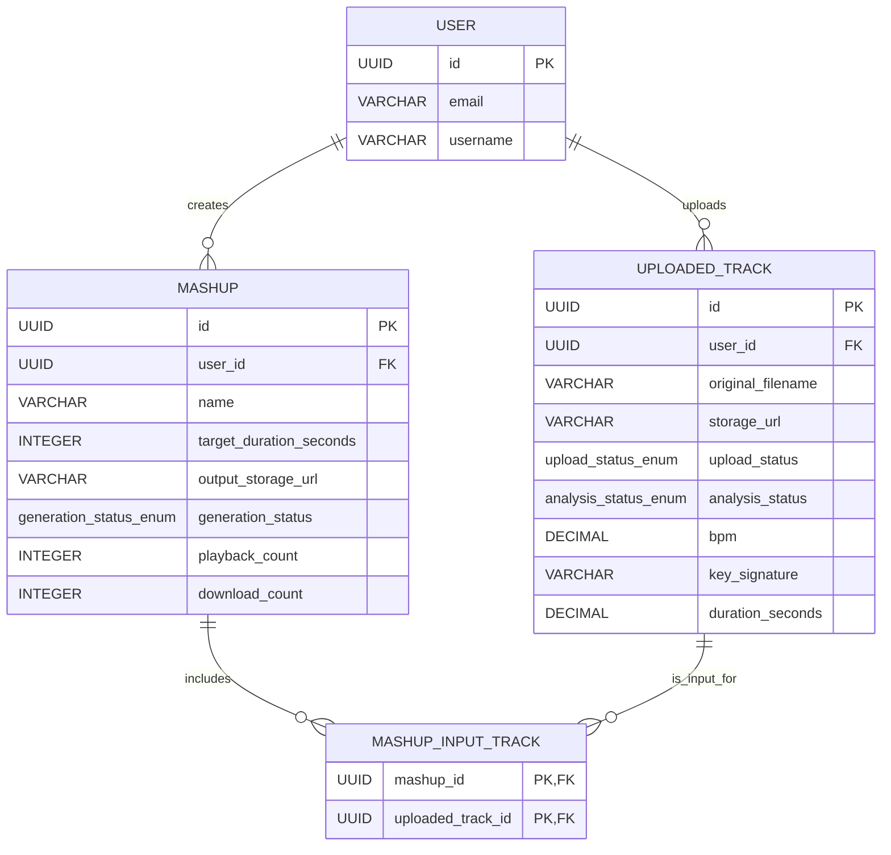

### 1. ER Diagram (Mermaid)


### 2. Table Schemas

**users**
| Column | Type | Constraints |
|---|---|---|
| id | UUID | PK |
| email | VARCHAR(255) | UNIQUE, NOT NULL |
| password_hash | VARCHAR(255) | NOT NULL |
| username | VARCHAR(100) | NULLABLE |
| created_at | TIMESTAMP | NOT NULL, DEFAULT CURRENT_TIMESTAMP |
| updated_at | TIMESTAMP | NOT NULL, DEFAULT CURRENT_TIMESTAMP |

**uploaded_tracks**
| Column | Type | Constraints |
|---|---|---|
| id | UUID | PK |
| user_id | UUID | FK users(id), NOT NULL |
| original_filename | VARCHAR(255) | NOT NULL |
| storage_url | VARCHAR(512) | NOT NULL |
| file_size_bytes | BIGINT | NOT NULL |
| mime_type | VARCHAR(50) | NOT NULL |
| upload_status | upload_status_enum | NOT NULL, DEFAULT 'pending' |
| analysis_status | analysis_status_enum | NOT NULL, DEFAULT 'pending' |
| bpm | DECIMAL(5,2) | NULLABLE |
| key_signature | VARCHAR(20) | NULLABLE |
| duration_seconds | DECIMAL(7,2) | NULLABLE |
| has_stems | BOOLEAN | NOT NULL, DEFAULT FALSE |
| created_at | TIMESTAMP | NOT NULL, DEFAULT CURRENT_TIMESTAMP |
| updated_at | TIMESTAMP | NOT NULL, DEFAULT CURRENT_TIMESTAMP |

**mashups**
| Column | Type | Constraints |
|---|---|---|
| id | UUID | PK |
| user_id | UUID | FK users(id), NOT NULL |
| name | VARCHAR(255) | NOT NULL |
| target_duration_seconds | INTEGER | NOT NULL |
| output_storage_url | VARCHAR(512) | NULLABLE |
| generation_status | generation_status_enum | NOT NULL, DEFAULT 'pending' |
| playback_count | INTEGER | NOT NULL, DEFAULT 0 |
| download_count | INTEGER | NOT NULL, DEFAULT 0 |
| created_at | TIMESTAMP | NOT NULL, DEFAULT CURRENT_TIMESTAMP |
| updated_at | TIMESTAMP | NOT NULL, DEFAULT CURRENT_TIMESTAMP |

**mashup_input_tracks**
| Column | Type | Constraints |
|---|---|---|
| mashup_id | UUID | PK, FK mashups(id) |
| uploaded_track_id | UUID | PK, FK uploaded_tracks(id) |
| created_at | TIMESTAMP | NOT NULL, DEFAULT CURRENT_TIMESTAMP |

### 3. Key Indexes
- `idx_users_email` on `users(email)`
- `idx_uploaded_tracks_user_id` on `uploaded_tracks(user_id)`
- `idx_mashups_user_id` on `mashups(user_id)`

### 4. Enums
```sql
CREATE TYPE upload_status_enum AS ENUM ('pending', 'uploaded', 'failed');
CREATE TYPE analysis_status_enum AS ENUM ('pending', 'analyzing', 'completed', 'failed');
CREATE TYPE generation_status_enum AS ENUM ('pending', 'generating', 'completed', 'failed');
```